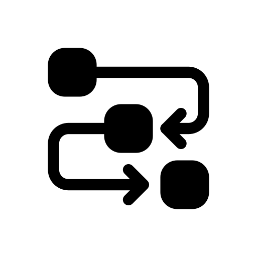

<!-- TaskFlow - Modern Kanban Board -->
<p align="center">
  
</p>

<h1 align="center">TaskFlow</h1>

<p align="center">
  A minimal, beautiful Kanban board for managing tasks with fluid drag-and-drop, built with Next.js 16 and React 19.
</p>

<p align="center">
  <a href="https://github.com/yahyazoom17/taskflow">
    
  </a>
  <a href="https://vercel.com">
    
  </a>
  
  
  
</p>

---

## ✨ Features

| Feature | Description |
|---------|-------------|
| **Drag & Drop** | Move tasks between columns and reorder with intuitive drag-and-drop powered by @dnd-kit |
| **Full CRUD** | Create, edit, and delete tasks through a clean modal dialog |
| **Persistent Storage** | Tasks auto-save to a local JSON file — your data is always safe |
| **Search** | Find tasks instantly by keyword |
| **Priority Badges** | Visual urgency indicators with Low, Medium, and High labels |
| **Due Dates** | Assign and track deadlines with a built-in date picker |
| **Dark Mode** | System-aware theme with manual toggle — works perfectly in any environment |
| **Toast Notifications** | Instant feedback on every action via Sonner |
| **Optimistic UI** | Lightning-fast updates — no waiting for the server |
| **Keyboard Accessible** | Full keyboard navigation for drag-and-drop |
| **Responsive Design** | Flawless on desktop, tablet, and mobile |

---

## 🚀 Quick Start

```bash
# Clone the repository
git clone https://github.com/yahyazoom17/taskflow.git
cd taskflow

# Install dependencies
npm install

# Start the development server
npm run dev
```

Open [http://localhost:3000](http://localhost:3000) — the landing page will guide you to the board.

---

## 🛠️ Tech Stack

- **Framework:** Next.js 16 (App Router)
- **Language:** TypeScript 5
- **UI Library:** React 19
- **Styling:** Tailwind CSS 4 + shadcn/ui
- **Drag & Drop:** @dnd-kit
- **Icons:** Lucide React
- **Theming:** next-themes
- **Notifications:** Sonner
- **Database:** Local JSON file (`db/tasks.json`)

---

## 📁 Project Structure

```
taskflow/
├── app/
│   ├── board/              # Kanban board page
│   │   ├── page.tsx        # Server component (fetches tasks)
│   │   ├── loading.tsx    # Loading skeleton
│   │   └── kanban-board-client.tsx  # Client component (DnD logic)
│   ├── loading.tsx         # Landing page loading state
│   ├── layout.tsx          # Root layout with providers
│   └── page.tsx            # Landing page
│
├── components/
│   ├── kanban-board.tsx    # Main board component
│   ├── kanban-column.tsx   # Column (droppable)
│   ├── task-card.tsx       # Task card (draggable)
│   ├── task-dialog.tsx    # Create/edit modal
│   ├── search-bar.tsx      # Search component
│   ├── theme-toggle.tsx    # Dark mode toggle
│   ├── github-icon.tsx     # GitHub icon
│   └── ui/                 # shadcn/ui primitives
│
├── lib/
│   ├── actions.ts          # Server actions (CRUD)
│   ├── db.ts              # JSON file read/write
│   ├── types.ts           # TypeScript types
│   └── utils.ts           # Utilities
│
├── db/
│   └── tasks.json          # Persistent task storage
│
└── public/
    └── brand.png           # App logo
```

---

## 🐳 Docker

### Build & Run

```bash
# Build the image
docker build -t taskflow .

# Run the container
docker run -p 3000:3000 taskflow
```

### Persist Data

```bash
# Mount a volume to keep tasks across restarts
docker run -p 3000:3000 -v taskflow_db:/app/db taskflow
```

### Docker Compose

```yaml
services:
  taskflow:
    build: .
    ports:
      - "3000:3000"
    volumes:
      - taskflow_db:/app/db
    restart: unless-stopped

volumes:
  taskflow_db:
```

---

## 🌐 Deployment

### Vercel (Recommended)

1. Push your code to GitHub
2. Import at [vercel.com/new](https://vercel.com/new)
3. Deploy — done!

> ⚠️ **Note:** Vercel's serverless functions reset the file system on each deployment. For production, migrate to a database like [Vercel Postgres](https://vercel.com/docs/storage/vercel-postgres), [Supabase](https://supabase.com), or [PlanetScale](https://planetscale.com).

### Self-Hosted

Use the Docker setup above, or deploy to any Node.js host.

---

## 🤝 Contributing

Contributions are welcome! Feel free to open issues, submit PRs, or suggest features.

---

## 📄 License

MIT — see [LICENSE](LICENSE) for details.

---

<p align="center">
  Built with ❤️ by <a href="https://github.com/yahyazoom17">Yahya</a>
</p>

<p align="center">
  <sub>Inspired by <a href="https://linear.app">Linear</a>, <a href="https://notion.so">Notion</a>, and <a href="https://trello.com">Trello</a></sub>
</p>